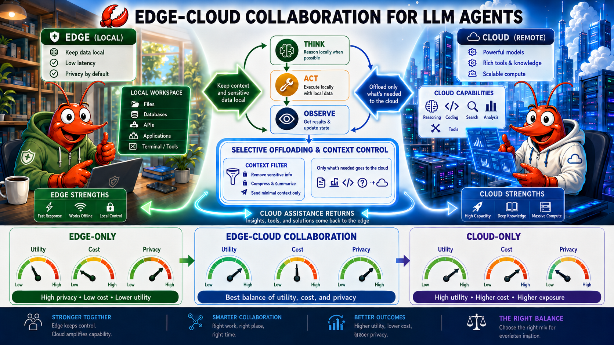
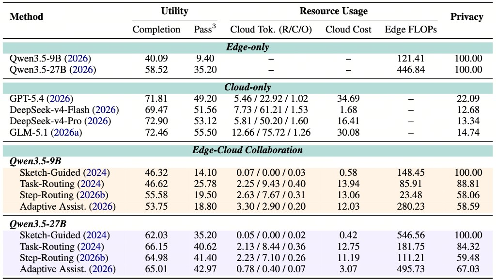

<div align="center">


# AceBench



[](tasks/ACE_Bench)
[](#tasks)
[](#quick-start)
[](https://openclaw.ai/)
[](#citation)
[](LICENSE)

> **Empowering Edge Agents:** A Multi-Dimensional Benchmark for Agentic Edge-Cloud Collaboration.

> 128 executable tasks · 100 privacy-annotated · 6 strategies · Utility · Cost · Privacy.

</div>

---

**AceBench** is a benchmark for **edge-cloud collaboration** in LLM agents. Cloud models reason best but see all your data; on-device edge models keep data local but are weaker — collaboration promises the best of both, *if* you organize it well. AceBench measures exactly that, but in a setting prior edge-cloud studies skip: **real agent execution**, where agents work over live workspaces (files, tools, commands, APIs, app states) and every cloud call *mid-trajectory* can expose accumulated local context.

We evaluate six execution strategies — pure edge, pure cloud, and four edge-cloud collaboration patterns — across **128 executable tasks** (100 with fine-grained **privacy annotations**) on an [OpenClaw](https://openclaw.ai/) harness, scoring every run on three axes at once: **task utility**, **resource cost**, and **privacy exposure**. The result exposes how *when* the cloud is invoked and *what* context is sent trade capability against cost and leakage.

### Design Highlights

| | What we test | Why it matters |
| --- | --- | --- |
| 🦞 **OpenClaw-native** | The real OpenClaw agent loop — bash, browser, file ops, APIs, and reusable `SKILL.md` skills — driving a live local workspace | Tasks need long-horizon planning, state tracking, and error recovery; cloud calls land *mid-trajectory* over accumulated workspace context, not on a static prompt |
| 🔐 **Privacy-aware** | 100 tasks annotated with sensitivity units (PII + org secrets) | Every cloud invocation is a potential leakage channel — we audit what crosses the boundary |
| ⚖️ **Multi-dimensional** | Utility · Cost · Privacy, reported jointly | No single number hides the trade-off; you see the whole Pareto picture |
| 🔀 **Strategy-centric** | 6 edge / cloud / edge-cloud strategies, one task suite | Isolates *how* collaboration is organized from *which* models are used |
| 📦 **Reproducible** | Each task runs in its own Docker container | Graders are injected only after the agent finishes — never visible during execution |

---

## Tasks

**128 executable tasks** across **6 categories** (Chinese & English); **100** carry fine-grained privacy annotations. Each is a self-contained Markdown file under [`tasks/ACE_Bench/`](tasks/ACE_Bench/) — a prompt, an inline `grade()` verifier, and a workspace path.

| Category | # | Example tasks | Core challenges |
| --- | --- | --- | --- |
| **Office & Daily Tasks** | 36 | ambiguous contact email, meeting notes, expense report, daily summary | Multi-source aggregation, clarification, structured output |
| **Information Search & Gathering** | 34 | email search, competitive intelligence, paper affiliation lookup, CRM bug hunt | Web + local data reconciliation, source verification |
| **Safety & Security** | 21 | leaked API-key detection, prompt injection, malicious skill, HIPAA/PHI referral | Adversarial robustness, credential awareness, refusal |
| **Data Analysis** | 14 | order-profit analysis, month-end reconciliation, quarterly business insight | Spreadsheet reasoning, state verification |
| **Development & Operations** | 13 | system health check, automation-failure recovery, LLM API gateway skill | Undocumented setups, debugging, skill creation |
| **Automation** | 10 | flight booking, n8n workflow report, scheduled-briefing skill | Long-horizon orchestration, recovery |

**Scoring.** Every run is graded on **three dimensions at once**:

- **Utility** — completion score + `Pass³` (3-trial consistency), from each task's own verifier.
- **Cost** — cloud tokens & USD, plus edge-side FLOPs.
- **Privacy** — how much annotated sensitive context (PII / org secrets) reaches the cloud.

---

## Leaderboard

Edge = **Qwen3.5-9B / 27B**, Cloud = **GPT-5.4**, judge = **GPT-5.4-mini**, averaged over 3 runs. Cloud Tok. = raw / cache / output (millions); Cost in USD; Edge FLOPs in PetaFLOPs; Utility & Privacy in %.

<div align="center">

</div>

Edge-cloud collaboration beats both single-side extremes on the utility–privacy trade-off; **Sketch-Guided** keeps privacy at 100%, **Task-Routing** is the most balanced, and **Adaptive Assistance** gets the best `Pass³` at <10% of Cloud-only cost.

---

## Quick Start

AceBench runs each task in an isolated Docker container bundling the OpenClaw harness and per-task mock services.

**1. Install dependencies & load the image**

The prebuilt container image is hosted on Hugging Face as a `docker save` tarball (Hugging Face is not a Docker registry, so download + `docker load` instead of `docker pull`):

```bash
cd AceBench
conda create -n acebench python=3.13 -y
pip install -r requirements.txt
# download the image
hf download chengpingan/AceBench \
    Images/acebench-openclaw-v1.0.tar.gz --repo-type dataset --local-dir .

# download the workspaces (single tarball) and extract
hf download chengpingan/AceBench \
    workspace/ACE_Bench.tar.gz --repo-type dataset --local-dir .
tar -xzf workspace/ACE_Bench.tar.gz      # extracts into workspace/ACE_Bench/

docker load -i Images/acebench-openclaw-v1.0.tar.gz   # loads acebench-openclaw:v1.0 (must match DOCKER_IMAGE in .env)


```

**2. Configure keys** — copy `.env.example` to `.env` and fill in:

```bash
OPENROUTER_API_KEY=...                 # cloud collaborator (any OpenAI-compatible provider)
JUDGE_API_KEY=...                      # LLM-as-a-judge for utility & privacy
JUDGE_MODEL=gpt-5.4-mini
```

Edge / cloud model endpoints live in [`my_api.json`](my_api.json) (e.g. a local vLLM server) and are passed via `--models-config`.

**3. Prepare task assets**

```bash
bash script/prepare.sh         
```

**4. Run** — pick a strategy via `--run-mode`. Six strategies share one suite (full commands in [`script/run.sh`](script/run.sh)):

| Strategy | `--run-mode` | Cloud use | Idea |
| --- | --- | --- | --- |
| **Edge-only** | `local-only` | none | All steps on the edge model |
| **Cloud-only** | `cloud-only` | every step | Capability upper bound; highest exposure |
| **Sketch-Guided** | `pipeline-plan-executor` | once, upfront | Cloud drafts a high-level sketch; edge executes |
| **Task-Routing** | `query-router` | once, offline | RouteLLM routes the whole task to edge or cloud |
| **Step-Routing** | `step-router` | per uncertain step | Edge-first; escalate to cloud on high token entropy |
| **Adaptive Assistance** | `advisor` | on demand | Edge asks the cloud for a plan/hint when stuck |

```bash
# Edge-only baseline
python3 eval/run_batch.py --category ACE_Bench --parallel 16 --repeat 3 \
  --edge-model vllm/Qwen/Qwen3.5-27B --models-config my_api.json \
  --output-dir output/edge_only/qwen3.5-27b

# Edge-cloud (e.g. adaptive cloud assistance)
python3 eval/run_batch.py --category ACE_Bench --parallel 8 --repeat 3 \
  --run-mode advisor \
  --edge-model vllm/Qwen/Qwen3.5-27B --cloud-model your-provider/gpt-5.4 \
  --models-config my_api.json \
  --output-dir output/adaptive-assistant/qwen3.5-27b_to_gpt5.4
```

Single-task runs (`--task tasks/ACE_Bench/ACE_Bench_task_44_ambiguous_contact_email.md`), task filters (`--task-filter`), and privacy-judge timing (`--privacy-judge-mode {inline,deferred,off}`) are also supported.

---

## Check the Results

Per-task outputs land under `output/<run>/<task_id>/...` (scores, token/cost usage, agent trace, produced files), with a per-category and global summary generated automatically once the run finishes.

---


## Acknowledgements

AceBench stands on the shoulders of a remarkable open-source agent community, and we are deeply grateful for it. The **OpenClaw** harness gives us a real, full-featured agent runtime — tools, skills, and a live workspace — to build on. Our tasks and evaluation design draw inspiration and adapted material from a series of outstanding agent benchmarks: **Claw-Eval**, **WildClawBench**, **QwenClawBench**, **LiveClawBench**, **PinchBench**, and **ClawBench**. Their meticulous task curation, rigorous grading, and reproducible harness design set the bar for trustworthy agent evaluation, and made the privacy-aware, edge-cloud extension in AceBench possible.

## License

Released under the [MIT License](LICENSE).
